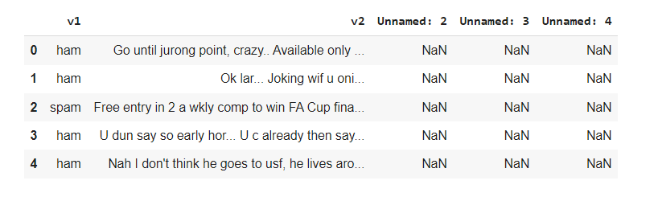
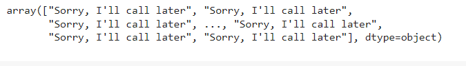
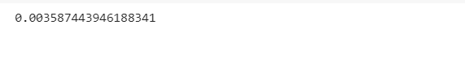

# Implementation-of-SVM-For-Spam-Mail-Detection

## AIM:
To write a program to implement the SVM For Spam Mail Detection.

## Equipments Required:
1. Hardware – PCs
2. Anaconda – Python 3.7 Installation / Moodle-Code Runner

## Algorithm
1. Start the program
2. Import the python pandas library as pd
3. Read the contents of the Spam csv file
4. Display the first 5 rows of the dataset using head()
5. Assign x as v1 values and y as v2 values
6. From sklearn library select the feature extraction and import CountVectorizer
7. CountVectorizer will convert the Text to Numerical Data
8. From sklearn library import Support Vector Classifier (ie. SVC)
9. Predict the x_test using SVC 10.Print the accuracy of the SVM Model
10. Stop the program

## Program:
```
/*
Program to implement the SVM For Spam Mail Detection..
Developed by: S.Shailesh Khanna
RegisterNumber: 212220040152

import pandas as pd
data = pd.read_csv("/content/spam.csv",encoding = 'latin-1')
data.head()
data.info()
data.isnull().sum()
x = data["v1"].values
y = data["v2"].values
from sklearn.model_selection import train_test_split
x_train,x_test,y_train,y_test = train_test_split(x,y,test_size = 0.2,random_state = 0)
from sklearn.feature_extraction.text import CountVectorizer
cv = CountVectorizer()    #CountVectorizer is a method to convert Text to Numerical Data
x_train = cv.fit_transform(x_train)
x_test = cv.transform(x_test)
from sklearn.svm import SVC
svc = SVC()
svc.fit(x_train,y_train)
y_pred = svc.predict(x_test)
y_pred
from sklearn import metrics
accuracy = metrics.accuracy_score(y_test,y_pred)
accuracy
*/
```

## Output:







## Result:
Thus the program to implement the SVM For Spam Mail Detection is written and verified using python programming.
